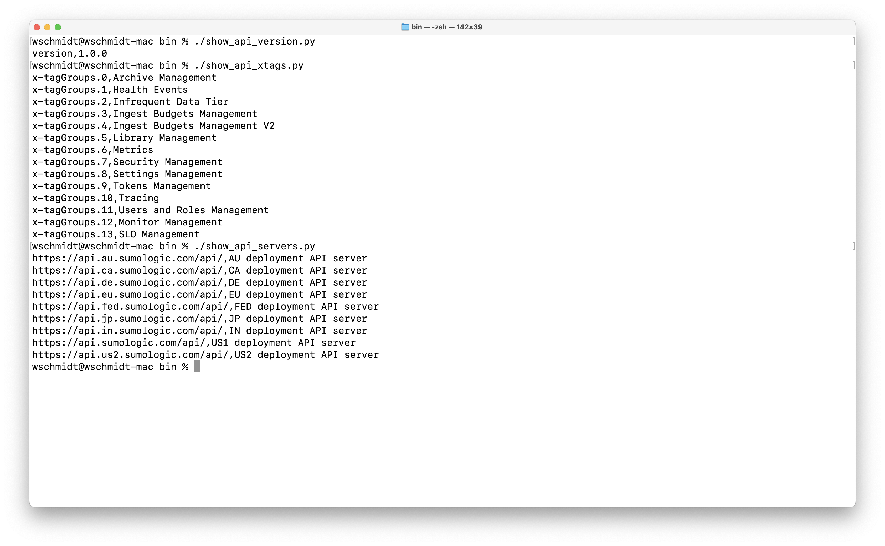
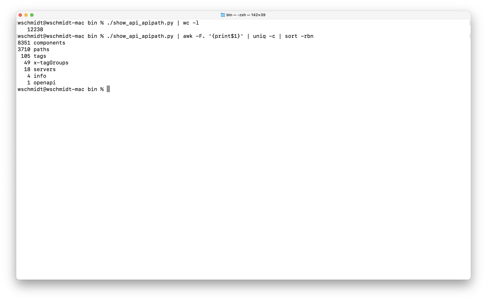
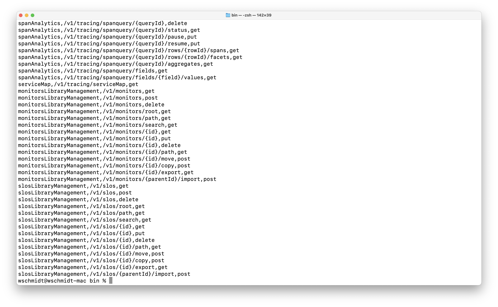

Business Background
===================

Your development pipeline wants to have integration with your observability solution, so it is important to have the observability partner be able to easily integrate with your other tools.

Here at Sumo Logic, we all teams alike, providing visibility across teams, pipelines, and services, and we make it easy for you to integrate your tools with ours, so you can automate your operations and development processes.

Business Challenge
==================

Now. Where to start? Base on your business goals, you might want to update Ingest Budgets, create hosted collectors, create ingest sources, but how can you approach that? What data is required and necessary to do this?

Sumo Logic has excellent documentation on the API [here](https://help.sumologic.com/APIs) also [here](https://api.sumologic.com/docs/) but we also want to have something we can use that the command line, to integrate with other tools. 

Here is where the swaggertools can help. You can quicky search through the complete API definition for the operations you need.

Business Cases
==============

Here are a sample of questions you want to have answers for to help your teams. 

* What items can we report on using the API?

* Where are the API servers Sumo Logic supports within the world? Which one is the closest to my business?

* What items can we create and update using the API?

* What dependencies do each Sumo Logic possess?

* What data needs to be provided to create, update Sumo Logic objects?

Business Solution
=================

You can quickly use swaggertools, and the setup is simple.

- Follow the steps in the [readme](../README.md).

Business Benefits
=================

Now, swaggertools can be used for more than just research. Building new command line tools can be both easy as well as dynamic by:

*   download the swagger API yaml file

*   automatically create operations you want to use from the yaml file

*   layer on the business logic ( how do you want to use the building block actions in the API definition file )

The dynamic CLI is something we will cover in another solution writeup, but it will be based on our swaggertools.

The result? The ability to keep up with the pace of change, so that when the swagger file changes your tools will automatically know.

Examples
========

